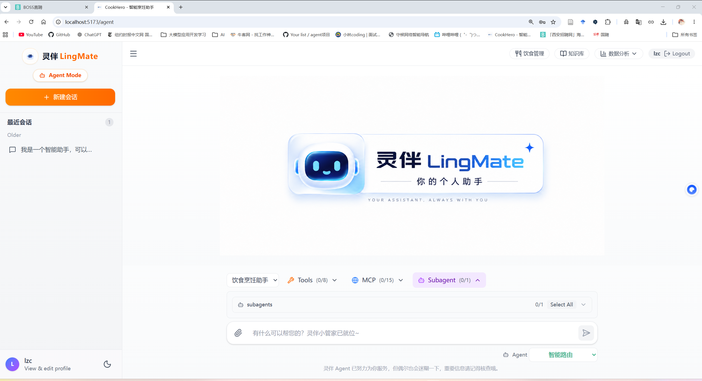

<div align="center">


**可扩展多场景 Agent 智能体工作台**

[](https://www.python.org/)
[](https://fastapi.tiangolo.com/)
[](https://www.langchain.com/)
[](https://milvus.io/)

---

</div>

<div align="center">
<p align="center">
  
  
</p>
</div>


---

## 项目简介

**LingMate** 是一个多场景 Agent 通用助手平台。系统以 Agent Router 为入口，根据用户意图自动路由到合适的专业智能体，并通过ReAct工具调用、MCP 服务接入、知识库检索、多模态理解、长期上下文和流式交互为用户提供可执行的个人助理能力。

项目当前内置出行规划、生活管理，通用问答、知识库检索、图片生成、网页搜索、计算、日期时间等能力；

- **智能路由**：根据当前消息和上下文自动选择合适的 Agent
- **专业智能体**：支持出行规划、生活管理、知识查询等垂直助手扩展
- **工具调用**：统一接入本地工具、MCP 工具和 Subagent 工具
- **个人知识库**：支持私人文档上传、索引、检索和引用来源
- **多模态交互**：支持图片理解与图片生成，覆盖更自然的表达方式
- **长期上下文**：会话摘要压缩、用户画像和长期指令辅助个性化响应
- **可观测性**：记录 LLM 使用量、工具调用轨迹、性能指标和 RAG 评估结果
- **安全防护**：提示词注入检测、速率限制、审计日志和敏感信息脱敏

---

## 技术亮点

- **多 Agent 架构**：Agent Router + 专业 Agent + Subagent，可按任务动态编排
- **统一 ToolHub**：本地工具、MCP 服务和 Subagent 均以工具形式统一注册和调用
- **RAG 混合检索**：向量检索、BM25、Reranker 与多级缓存组合
- **MCP 动态扩展**：支持用户配置 MCP Server，并绑定到指定 Agent
- **多模态能力**：图片输入解析、AI 图片生成和外部图床持久化
- **可观测与评估**：RAGAS 质量评估、LLM Token 统计、工具执行追踪
- **现代化全栈**：FastAPI + React + MYSQL + Milvus + Redis + MinIO

## 核心功能

### 1. 多 Agent 对话工作台

- 默认进入智能路由，由系统选择最合适的专业 Agent
- 支持显式选择 Agent，并在前端动态选择可用工具
- SSE 流式响应，实时展示思考、路由、工具调用和最终回答
- 会话持久化、标题更新、历史消息加载和删除
- 长对话自动压缩，降低 Token 消耗并保留关键上下文

### 2. 内置专业 Agent

- **智能路由 Agent**：负责兜底、澄清、分诊和通用问题处理
- **旅行规划助手**：处理地图查询、路线规划、跨城交通、行程安排、行李清单等出行任务
- **生活管理类垂直能力**：保留饮食计划、记录、营养统计等模块，可作为个人助手的可选工具域使用
- **自定义 Subagent**：用户可创建自己的专家助手，配置独立提示词和工具集

### 3. 工具与 MCP 扩展

- **通用工具**：计算器、日期时间、Web 搜索、知识库检索、AI 图片生成
- **地图与出行工具**：通过 MCP 接入高德地图、12306 等外部服务
- **个人管理工具**：可选接入饮食计划、记录、分析等个人数据工具
- **用户级 MCP 配置**：支持新增、启用、禁用、绑定和鉴权头配置
- **工具选择器**：前端按 Agent 展示本地工具、MCP 工具和 Subagent 工具

### 4. 个人知识库与 RAG

- 上传个人文档并自动解析、切分、嵌入和索引
- 支持全局知识库与个人知识库融合检索
- 检索结果可返回来源信息，方便追溯和核查
- 支持向量检索、关键词检索、元数据过滤和重排序
- Redis + Milvus 多级缓存提升检索与生成性能

### 5. 多模态与图片能力

- 支持上传图片参与 Agent 对话
- 支持 OpenAI 兼容视觉模型进行图片理解
- 支持 DALL-E 3 等图片生成模型
- 生成图片可自动上传到 imgbb 进行持久化存储

### 6. 评估、统计与安全

- RAGAS 自动化评估答案忠实度和相关性
- LLM 使用统计覆盖 Token、响应时间、工具名称和模块来源
- 前端提供评估监控与模型统计页面
- 速率限制、登录失败锁定、JWT 过期策略和安全响应头
- 结构化审计日志、API Key 过滤和日志脱敏

详细安全架构请参阅 [安全策略文档](docs/SECURITY.md)。

---

## 快速开始

### 前置要求

- **Python**：>= 3.12
- **Node.js**：>= 18
- **Docker** 和 **Docker Compose**（推荐）

### 1. 获取项目

```bash
git clone https://github.com/luzhanchun/LingMate.git
cd LingMate
```

### 2. 配置环境变量

```bash
cp .env.example .env
# 编辑 .env，填入 LLM、数据库、Web 搜索、MCP、图片生成等配置
```

### 3. 启动基础设施

```bash
cd deployments
docker-compose up -d
cd ..
```

这将启动：

- PostgreSQL：`5432`
- Redis：`6379`
- Milvus：`19530`
- MinIO：`9001`
- Etcd：内部服务

### 4. 安装依赖并启动后端

本项目的 Python 命令请始终通过 `cook` Conda 环境执行：

```bash
conda run -n cook pip install -r requirements.txt

# 可选：初始化示例知识库数据
conda run -n cook python -m scripts.howtocook_loader

# 启动后端服务
conda run -n cook uvicorn app.main:app --host 0.0.0.0 --port 8000 --reload
```

### 5. 启动前端

```bash
cd frontend
npm install
npm run dev
```

### 6. 访问应用

- Agent 工作台：http://localhost:5173/agent
- 普通对话：http://localhost:5173/chat
- 个人知识库：http://localhost:5173/knowledge
- 评估监控：http://localhost:5173/evaluation
- 模型统计：http://localhost:5173/llm-stats
- 后端 API：http://localhost:8000
- API 文档：http://localhost:8000/docs

---

## 配置说明

### 1. 环境变量 (`.env`)

创建 `.env` 文件（参考 `.env.example`）：

```env
# ==================== LLM API 配置 ====================
LLM_API_KEY=your_main_api_key
FAST_LLM_API_KEY=your_fast_model_api_key
VISION_API_KEY=your_vision_model_api_key
RERANKER_API_KEY=your_reranker_api_key

# ==================== 数据库配置 ====================
DATABASE_PASSWORD=your_postgres_password
REDIS_PASSWORD=your_redis_password
MILVUS_USER=root
MILVUS_PASSWORD=your_milvus_password

# ==================== Web 搜索 ====================
WEB_SEARCH_API_KEY=your_tavily_api_key

# ==================== MCP 集成 ====================
AMAP_API_KEY=your_amap_api_key

# ==================== 图片生成与存储 ====================
IMAGE_GENERATION_API_KEY=your_openai_api_key
IMGBB_STORAGE_API_KEY=your_imgbb_api_key

# ==================== 安全认证 ====================
JWT_SECRET_KEY=your_secure_jwt_secret_key
JWT_ALGORITHM=HS256
ACCESS_TOKEN_EXPIRE_MINUTES=60
REFRESH_TOKEN_EXPIRE_DAYS=7

# ==================== 速率限制与输入安全 ====================
RATE_LIMIT_ENABLED=true
RATE_LIMIT_LOGIN_PER_MINUTE=5
RATE_LIMIT_CONVERSATION_PER_MINUTE=30
RATE_LIMIT_GLOBAL_PER_MINUTE=100
LOGIN_MAX_FAILED_ATTEMPTS=5
LOGIN_LOCKOUT_MINUTES=15
MAX_MESSAGE_LENGTH=10000
MAX_IMAGE_SIZE_MB=5
PROMPT_GUARD_ENABLED=true
```

### 2. 主配置文件 (`config.yml`)

`config.yml` 包含应用核心配置：

```yaml
llm:
  fast:    # 快速模型，用于路由、意图识别、轻量改写等
  normal:  # 标准模型，用于主要回答和 Agent 推理
  vision:  # 视觉模型，用于图片理解

paths:
  base_data_path: "data/HowToCook"  # 可替换为自己的全局知识库路径

embedding:
  model_name: "BAAI/bge-small-zh-v1.5"

vector_store:
  type: "milvus"
  collection_names:
    recipes: "cook_hero_recipes"
    personal: "cook_hero_personal_docs"

retrieval:
  top_k: 9
  score_threshold: 0.2
  ranker_type: "weighted"
  ranker_weights: [0.8, 0.2]

reranker:
  enabled: true
  model_name: "Qwen/Qwen3-Reranker-8B"

cache:
  enabled: true
  ttl: 3600
  l2_enabled: true
  similarity_threshold: 0.92

web_search:
  enabled: true
  max_results: 6

vision:
  model:
    enabled: true
    model_name: "Qwen/QVQ-72B-Preview"

evaluation:
  enabled: true
  async_mode: true
  sample_rate: 1.0

mcp:
  amap:
    enabled: true

image_generation:
  enabled: true
  model: "dall-e-3"

image_storage:
  enabled: true

database:
  postgres:
    host: "localhost"
    port: 5432
  redis:
    host: "localhost"
    port: 6379
  milvus:
    host: "localhost"
    port: 19530
```

详细配置说明见 `config.yml` 文件中的注释。